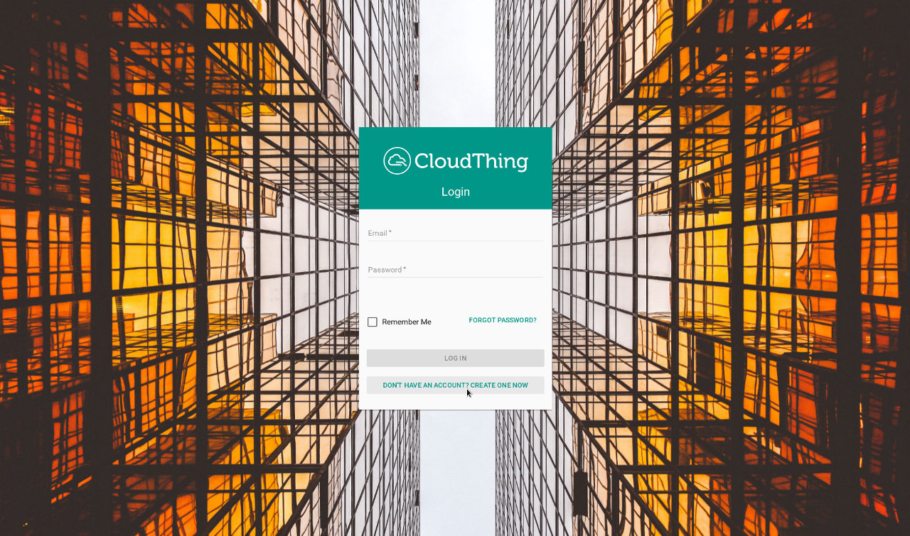
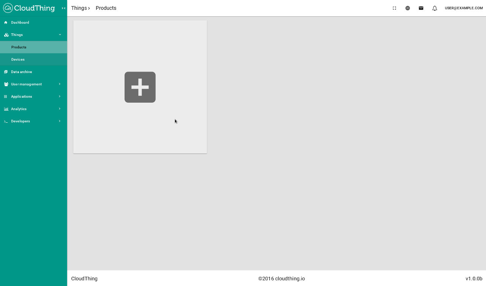
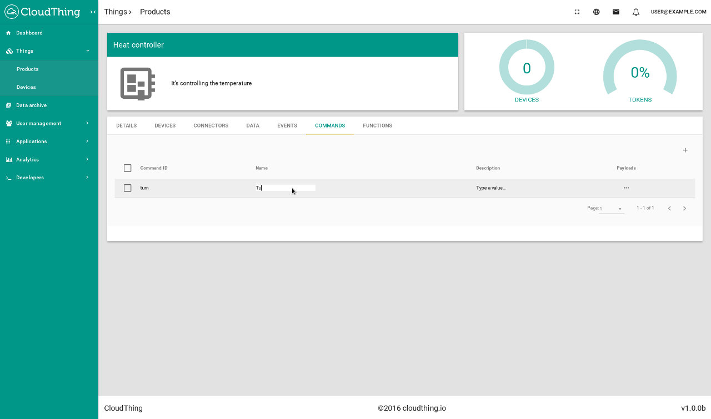
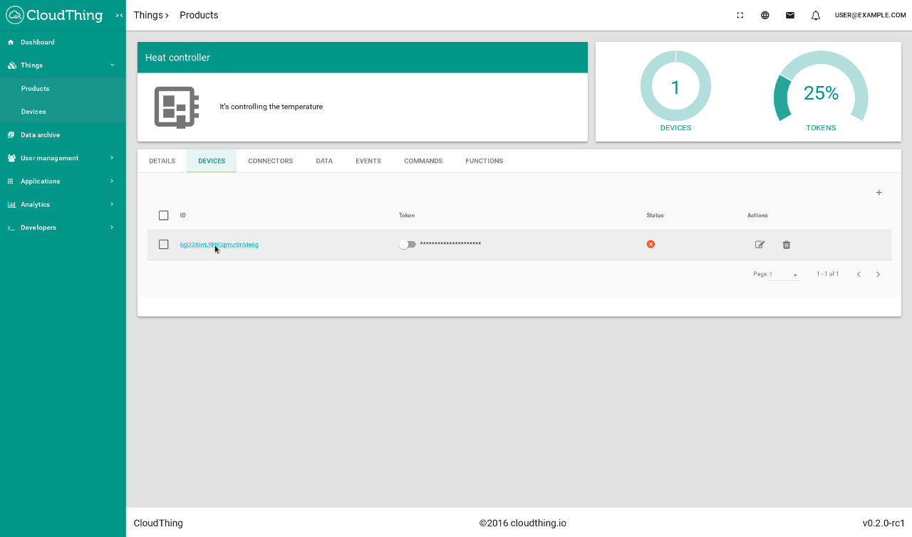
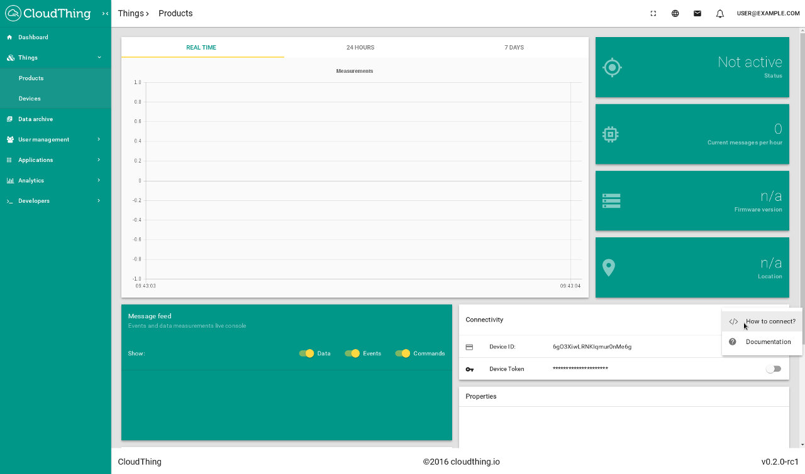
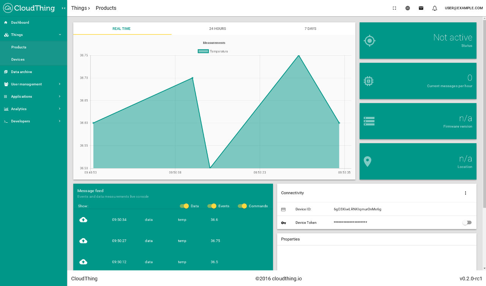
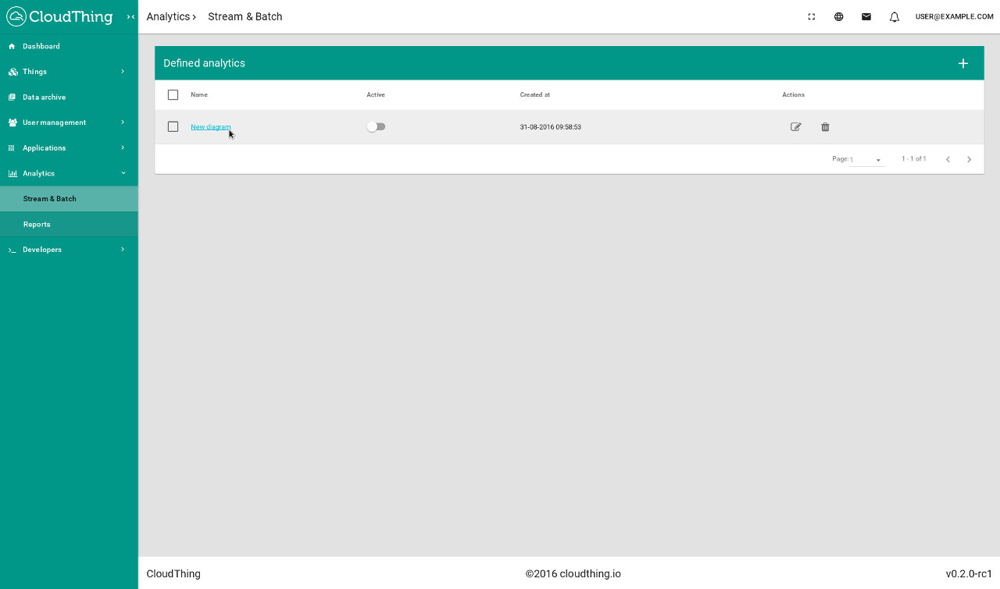
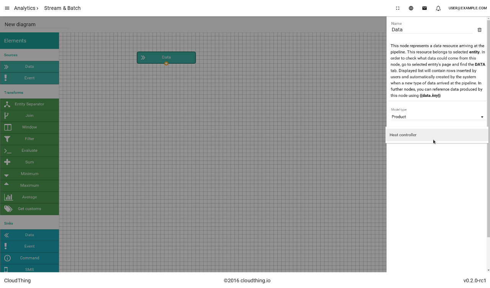
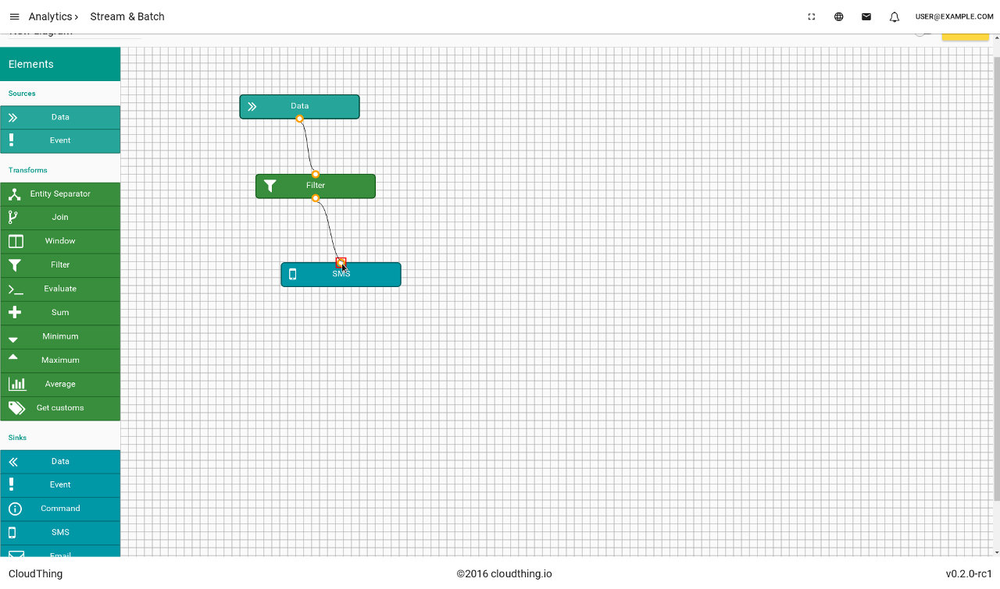

.. CloudThing documentation master file, created by
   sphinx-quickstart on Sun May  8 19:31:11 2016.
   You can adapt this file completely to your liking, but it should at least
   contain the root `toctree` directive.

******************
Getting Started
******************

.. contents::
    :local:
    :depth: 2

Quickstart with web application
=============================================

During this 5 minute quickstart, you'll create and model heat controller, register new device, automate it and set an alert with SMS notification.

Registration
-------------------

Go to ``https://app.cloudthing.io``, choose *I don't have an account* and follow the instructions. After a successful registration, you will receive a new virtual host with autogenerated tenant's name. We will send you an email with confirmation link.  Without the confirmation, you won't be able to log into your account, so make sure that you entered correct email address.
Please remember your tenant's name and the URL to your instance of the CloudThing platform!

Create new product
-------------------

Once you've logged in into the web application, navigate to *Things > Product* and create a new one by clicking on plus mark. Choose name and (optionally) description (e.g. "Heat controller", "This Heat Controller is a set of Smart Home ecosystem"). Click on *Save & configure*.

Go to *DATA* tab and add a new entry, set values in columns 'Data ID', 'Name' and 'Description' to "temp", "Temperature" and "Temperature reported by controller" respectively. Then go to *COMMANDS* and add new entry with "turn", "Turn" and "Turns heating on or off" in 'Command ID', 'Name' and 'Description' columns. That way you declare what information is sent by devices and what messages they receive. This step is not necessary - the platform will register new data at arrival, however setting these resources beforehand makes it easier to configure the system.

Register & connect device
-------------------

If you completed the previous step, go to *DEVICES* and add a new one. A new ID/token pair will be generated, click on ID and go to Device card.

As you can see the device is not active which means that it has never sent any messages to the platform. To start sending measurements expand a menu on *Connectivity* card and choose *How to connect?*. Copy value from MQTT or HTTP card (you'll have to have a MQTT client installed on your computer if want to use it, for HTTP you just need *curl* which is preinstalled on most Linux distributions).

Execute command from your computer's console, for example:

.. code-block:: bash

	curl -H "Content-Type: application/json" \
	-u "dxM18Pd_T3yfsdds1x9AxFQ:HMb7Ug0nv3h8duyVfwwh5jIgce81dg3l" \
	-X POST https://vanilla-ice.cloudthing.io:444/v1/dxM18Pd_T3yfsdds1x9AxFQ/data \
	-d '{"r":[{"k":"temp","v":36.6}]}'

You should see a new message and a point on application's chart.
Try replacing default value with others and see how the chart is changing.

Create analytics flow
-------------------

Now, when you have a working simulated device, you can create data flows and analytics. Navigate to *Analytics > Stream & Batch* and create new pipeline. Click on its name in order to edit the diagram.

You will see a blank canvas with nodes on the side to choose from. Drag a *Data* node and drop it on the canvas. This node represents data that arrive to the system. Click on it to edit options within the node. Choose the product which you defined earlier as a source *entity*. Add a *Filter* node and set its *expression* to ``{{data.temp}} > 40``. Connect *Data* node to the filter. *Filter* node will pass only those packets which fulfill given condition. The last step is to add a sink node - it will perform an action for every packet it receives. Choose an *SMS* node, fill the phone number (with '+' sign and your country's calling code) and write a message for you, e.g. ``The temperature is {{data.temp}}. It is too hot!``. Connect filter node to the SMS node.

When nodes are ready, click the *SAVE* button. If everything is fine with the diagram, you will see *The diagram was successfully saved. It can be deployed now.* message. Otherwise, warning signs will appear on the nodes and you will have to resolve these errors in order to proceed.
When the diagram is ready to be deployed, you can "turn it on": just click the switch next to *SAVE* button. You should see a message *The diagram was successfully deployed.*. That means that your flow is operational and is waiting for data to arrive.

You can test it by sending messages, just like you did it earlier. Try sending some messages with different *temp* values and see if you receive an SMS!
